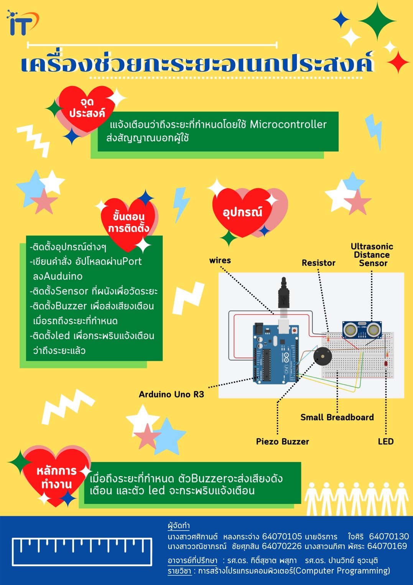

# เครื่องช่วยกะระยะอเนกประสงค์
> Computer Programming Project KMITL 2/2021
## บทคัดย่อ
> [บทคัดย่อ](https://docs.google.com/document/d/17J81PzNC73sh5suXLBtD6l07UebqFtdid0rZNNKPCx4/edit?usp=sharing)
## ที่มา
> เนื่องจากโควิด-19 นั้นสามารถติดต่อได้โดยง่ายจากการสัมผัสเชื้อและมาจับตา จมูก ปาก หรือ การที่สัมผัสและพูดคุยกับผู้ติดเชื้ออย่างใกล้ชิด ดังนั้นเพื่อลดการแพร่กระจายของไวรัสโคโรนาจึงเกิดมาตรการการเว้นระยะห่างทางสังคม เพื่อที่จะได้ระยะห่างที่พอดีจึงจึงจัดทำ "Microcontroller" ในรูปแบบเซนเซอร์ เพื่อที่จะได้ใช้วัดระยะห่างขึ้นมา และนอกจากจะช่วยในเรื่องกะระยะห่างทางสังคม ก็ยังสามารถนำไปประยุกต์ใช้ได้หลากหลาย
## วัตถุประสงค์
> แจ้งเตือนว่าถึงระยะที่กำหนดโดยใช้ Microcontroller ส่งสัญญาณบอกผู้ใช้
## ประโยชน์ที่ได้
> * ช่วยกะระยะได้แม่นยำขึ้น
> * สะดวกต่อการพกพา
> * สามารถนำไปประยุกต์ใช้ได้หลากหลาย เช่น ช่วยกะระยะในการจอดรถ
## อุปกรณ์
> * Arduino Uno R3
> * Ultrasonic Distance Sensor
> * Piezo Buzzer
> * LED
> * Resistor
> * breadboard small
## เว็บที่ใช้เขียนโค้ด
> [Tinkercad](https://www.tinkercad.com/things/eMeeZ9aW7B6-magnificent-robo-curcan/editel?sharecode=HCqukKKhMrvvCIHeHpARReJg8btFMs5zvuPSStovXCI)
## วิดีโอนำเสนอ
> [Youtube](https://youtu.be/whS6yeSOAUE)
## โปสเตอร์
> 
---
สมาชิก
---

| รหัสนักศึกษา | ชื่อ - นามสกุล |  หน้าที่ |
| :-------- | :-------- | :--------- |
|   64070105   |   ศศิกานต์ หลงกระจ่าง   |    Github / Abstract   |
|   64070130   |   จิรการ ใจศิริ   |    Microcontroller / Abstract   |
|   64070169   |   นภิศา พัศระ   |    Video Present   |
|   64070226   |   วณิชาภรณ์ ชัยศุภสิน   |    Poster   |

